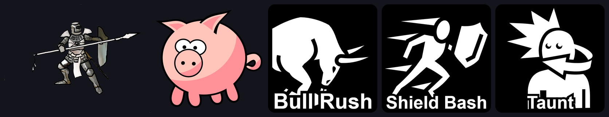

# BattleTrinity

A 2021 Unity prototype for a physics-driven tactics battler: grab units with a 3D cursor, aim a bull rush, and let 2D rigidbodies collide and bounce. An early experiment, not a finished game.

   



There is no build or download. To see it, open the project in the Unity editor (see Quick start).

## Why

- See an early MindAttic take on turn-based tactics where movement is physical: units are shoved, not placed.
- Read a small, readable Unity codebase (about 1,200 lines of C# in 15 scripts) built around simple state machines.
- Reuse the pieces: a 3D-plane mouse cursor that drags sprites, a scroll and follow camera, and a collision-based bull rush.

## Features

- 3D cursor: the mouse is projected onto the play plane, the cursor scales with camera distance, a held left button drags the hovered object, and a right click selects it (`Cursor3D`, `ICursorClick`).
- Bull rush: an actor in the bull-rush state is driven by force along its direction; hitting another actor stops it, and an idle actor that is hit bounces away (`Actor`, `Rigidbody2D`).
- Turn state machine: Turn Start, Select Target, Choose Direction, Measure Distance, Resolve and Turn End (`TurnManager`). Most states are stubs.
- Camera with scroll and follow modes (`CameraManager`).
- Teams of actors behind an `IActor` interface (`Team`, `TeamManager`).
- Three skill buttons wired for Bull Rush, Shield Bash and Taunt; their handlers are empty so far (`GUIManager`).
- A debug overlay showing running time.

## Quick start

1. Install Unity 2020.1.3f1 through Unity Hub.
2. Clone the repo and open the folder in Unity Hub.
3. Open `Assets/Resources/Scenes/SampleScene.unity` and press Play.

```bash
git clone https://github.com/mindattic/BattleTrinity.git
```

## How it works

```text
GameManager (pause toggle, owns TurnManager)
  |-- TurnManager   TurnStart -> SelectTarget -> ChooseDirection -> MeasureDistance -> Resolve -> TurnEnd
  |-- Cursor3D      mouse ray -> play plane; left drag moves hovered actor, right click selects it
  |-- Actor         Idle | Moving | BullRush; collisions stop the rusher and bounce the target
  |-- CameraManager Scroll | Follow
  `-- GUIManager    skill buttons (Bull Rush, Shield Bash, Taunt), debug labels
```

## Project layout

```text
Assets/
  Resources/
    Scripts/          GameManager, TurnManager, Actor, ActorBase, Cursor2D, Cursor3D,
                      CameraManager, GUIManager, Common, Constants, Enumerations,
                      Interface/ (IActor, ICursorClick), Models/ (Team)
    Scenes/           SampleScene.unity
    Sprites/          knight, piggy, pointers, reticle, skill icons
    Background/       grass background
  TeamManager.cs
ProjectSettings/      Unity 2020.1.3f1 settings
```

## Limitations

- Five commits from February and March 2021; development stopped at the prototype stage.
- Skills, targeting, distance measurement and resolution are not implemented yet.
- The Unity `Library/` folder is committed, which makes the repo large; a fresh clone re-imports anyway.

## Documentation

This repo has no docs folder. The later tactical grid games are [GridGame](https://github.com/mindattic/GridGame), [GridGame2025](https://github.com/mindattic/GridGame2025) and [GridGame2026](https://github.com/mindattic/GridGame2026).

## License

This repo has no LICENSE file. All rights reserved.

Part of [MindAttic](https://mindattic.com) — see more projects at [github.com/mindattic](https://github.com/mindattic). Related: [GridGame2026](https://github.com/mindattic/GridGame2026).
